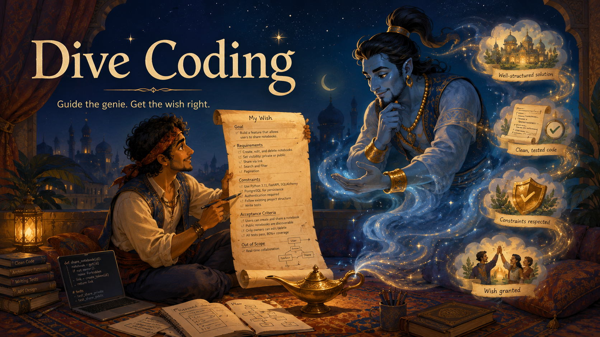

# divecode

<p align="center">
  
</p>

<p align="center">
  <strong>한국어</strong> ·
  <a href="README.en.md">English</a> ·
  <a href="README.ja.md">日本語</a> ·
  <a href="README.zh-Hans.md">简体中文</a>
</p>

> divecoding은 방법론, divecode는 그걸 실행하는 도구.

알라딘 첫 소원 기억나죠. "공주랑 결혼하게 왕자로 만들어줘." 지니는 글자 그대로 들어줍니다. 알라딘은 왕자 칭호도, 코끼리도, 행렬도 다 얻었는데 공주는 못 얻었어요.

코딩 에이전트가 지니입니다. 소원을 글자 그대로 받아요. "Redis 캐시와 5분마다 도는 cron job 있는 admin dashboard 만들어줘" 라고 하면 그 문장 그대로 구현해버립니다. TTL에 jitter를 줄지 안 물어봅니다. cron이 겹칠 때 idempotent하게 처리할지도 안 묻고, 캐시가 cold일 때 dashboard가 어떻게 보일지도 안 물어요. 소원에 안 적혔으니까.

3주 뒤 프로덕션에 불이 납니다. 안 적힌 게 다 터지면서.

divecoding은 들어주기 전에 되묻는 지니입니다. 대충 쓴 소원 (PRD든 한 줄 명령이든 스케치든) 던지면, divecode가 어떤 *pattern packs* 가 걸리는지 찾아내고 (redis-cache, admin-dashboard, vercel-serverless, postgres-saas, payments…), 명시 안 한 질문을 하나씩 묻습니다. Cache stampede. Cron 겹침. Auto-refresh DDoS. Replica lag. SCA 중도이탈. 진짜로 의도했던 그 소원.

이게 핵심이고, 나머지는 (AWS AI-DLC macro flow, agent-flow guardrail, TDD gate, PR watcher) 명확해진 소원이 실제 코드까지 살아남도록 받쳐주는 장치들입니다.

## 지니 원칙 (The Genie principle)

소원을 들어주기 전 divecode가 묻는 세 가지:

1. 글자 그대로의 소원은 X. 맞아요?
2. 명시 안 했지만 X가 의존하는 것들: A, B, C. (걸린 pack에서 추출.)
3. 지금 명시 안 하면 X는 글자 그대로 들어집니다. 명시할래요?

divecoding의 유일한 보편 규칙입니다. 페이즈 (inception → construction → operations), 프로파일 (light / standard / strict), pack, gate. 전부 이 지니의 멈춤을 적절한 입도로 구현한 장치예요. throwaway script는 한 줄짜리 멈춤, payments 통합은 20문항짜리 멈춤. 원리는 같습니다.

작동하는 이유는 단순해요. 지니는 뭐든 들어줍니다 (요즘 에이전트는 거의 모든 코드를 작성하니까). 병목은 더 이상 능력이 아니라 구체성이에요. divecoding은 그 구체성 자체를 작업으로 만듭니다.

## 원래 개발자가 하던 일

Vibe coding이 가르친 것:
- 코드는 빠르게 흘러나옵니다.
- 대부분의 코드는 누가 써도 비슷합니다.
- 에이전트가 typing을 대신해줍니다.

가르치지 않은 것:
- 왜 그렇게 짰는지.
- 어떤 트레이드오프가 있었는지.
- 한 달 뒤 누가 이 코드를 다시 읽게 될지.

원래 개발자는 후자를 하는 사람이었습니다. 코드 한 줄 치기 전에 — 요구사항을 정확히 읽고, 엣지케이스를 그려보고, 데이터 모델을 스케치하고, 알고리즘을 고르고, 실패 가능성을 미리 보고, 트레이드오프를 결정하고, 그제서야 키보드를 쳤어요.

Vibe coding은 이 일곱 단계를 "describe what you want, accept what comes" 한 단계로 압축했습니다. 시간은 줄었는데, 사라진 단계마다 한 달 뒤 터지는 사고가 한 건씩 깔려요.

Dive coding은 그 일곱 단계를 한 단계씩 돌려놓습니다. 에이전트가 키보드 typing을 대신하는 자리는 그대로 두되, 그 앞에 있던 *생각하는* 단계를 사람에게 돌려주는 방식으로. 에이전트는 typing 대신 *질문* 으로 그 사고를 끌어냅니다.

| | Vibe coding | Dive coding |
|---|---|---|
| 입력 | 한 줄 소원 | 명세 (점점 정교해지는) |
| 페이스 | 에이전트가 결정 | 사람이 결정 |
| 출력 | 코드, 그다음 rework | 결정들, 그다음 한 번에 작동하는 코드 |
| 발견 시점 | 프로덕션에서 (몇 주 뒤) | 키보드 치기 전 (몇 분 뒤) |
| 개발자 역할 | typing 감독관 | 명세를 만드는 사람 |
| 발휘하는 기술 | 받아들이기 | 판단 · 취향 · 지식 |
| 문서화 | "써야지" | workflow에서 자연 산출 |
| 잘 맞는 경우 | 탐색, 일회용, 데모 | 포스트모템 쓸 만한 거 |
| 비유 | 받아쓰기 | 대화 |

Dive coding은 우리를 vibe-wisher에서 더 사려 깊은 wisher로 되돌려놓습니다. 에이전트가 더 좋은 답을 주는 게 아니라, 사람이 더 좋은 질문을 던지게 만드는 방식으로.

## 쓰면 뭐가 좋나

추상 말고 손에 잡히는 것들. divecode를 만들게 된 agent-cat 개발 과정의 실제 예시 위주로.

ship 전에 버그를 잡습니다, ship 후가 아니라.
agent-cat admin dashboard, 사고 3주 전: PRD에 "Redis 캐시"와 "Vercel cron 5분마다"가 있었습니다. divecode가 물었을 질문은 셋. TTL 얼마? jitter 줘? cron이 도는 동안 dashboard도 polling하면 어떻게 되지? 10분이면 끝낼 대화. 실제 사고 복구엔 일요일 오후 하나가 통째로 들어갔어요.

에이전트가 구조 결정으로 놀라게 하지 않습니다.
"data layer에선 Repository pattern 써라" 같은 건 밤 11시에 기억나는 규칙이 아니에요. 에이전트가 다음 파일 쓰기 전에 던지는 질문이 됩니다. "이건 eventually consistent야 strongly consistent야?" 도 마찬가지. 결정엔 30초, 되돌리는 데엔 3일 걸리는 부류.

PRD가 저절로 날카로워집니다, 더 쓰지 않고도.
세 문단짜리 spec 던지면 12개 질문 인터로게이션이 돌아옵니다. 답하면, 그 답이 design.md의 나머지가 돼요. 포맷 잡혀있고, 결정 로그 박혀있고, TDD slice로 바로 쪼갤 준비된 상태. 반쪽짜리에서 진짜 spec이 나옵니다.

문서화가 의무가 아니라 부산물이 됩니다.
divecode session 하나마다 design.md + risk-map.md + decision lore가 자동 산출. 6개월 뒤 "이거 왜 이렇게 짰지?" 가 나오면, 답이 날짜와 trade-off 적힌 파일에 있어요. 의도해서 쓴 게 아니라 workflow에서 떨어진 거.

시니어/주니어 페어가 더 잘 됩니다.
시니어가 "replica lag 생각해봤어?" 같은 질문의 출처였는데, 이제 divecode가 먼저 묻습니다. 시니어는 답을 review만, 매번 끄집어내지 않아도 돼요. 주니어는 강의 받는 대신 질문 자체를 보면서 배웁니다.

토큰 비용이 떨어집니다, 에이전트가 한 번에 짜니까.
Vibe-coding 사이클: 작성 → 어 이거 틀렸네 → 다시 → 또 틀렸네 → 다시. 매 사이클이 토큰을 태우죠. divecode는 사고를 앞으로 당겨서, 첫 생성이 보통 마지막 생성이 되게 만듭니다.

에이전트가 우리 팀 실제 결정으로 "학습"됩니다.
Lore 항목 (`~/.divecode/lore/` + `.divecode/lore/`)이 bolt 간, 세션 간 이어집니다. 지난달에 박은 Constraint ("integration test는 진짜 DB 쓴다, mock 금지") 가 이번 달 design.md에 자동으로 인용돼요. 부족 지식이 파일 지식이 됩니다.

## divecoding이 아닌 것

- 기획 프레임워크 아닙니다. 스토리포인트도, 스프린트도, 추정 포커도 없어요.
- 코드 생성기 아닙니다. 의도적으로 코드를 안 씁니다. 대신 질문을 씁니다.
- 무거운 방법론 아니에요. 인증서도, 의식도, Sprint Zero도 없습니다. "멈춰서, 실패 가능성을 끄집어내고, 그다음에 만든다" 정도.
- RAG 래퍼도 아니에요. Pattern pack은 능동적 질문 생성기이지 수동적 검색이 아닙니다. PRD에 "redis"가 있다고 일반 Redis 문서를 던지는 게 아니라, Redis 사용자가 프로덕션에서 실제로 물리는 것들을 묻습니다.

## 설치

```bash
curl -fsSL https://raw.githubusercontent.com/yong076/divecode/main/bootstrap.sh | bash
```

설치하면 `~/.divecode/`에 clone되고 `~/.claude/skills/`로 심링크됩니다. 다음 Claude Code 세션에서 어느 프로젝트 디렉토리에서든 `/divecode` 호출 가능.

첫 실행 시 repo를 보고 profile을 추천해요. 사용자가 확인하면 그 뒤로는 알아서 돕니다.

제거: `bash ~/.divecode/uninstall.sh`

## 프로파일

divecode는 세 가지 깊이로 동작합니다. ceremony 수준이 버그 위험도에 맞춰 조정돼요.

- light — prototype, 솔로 작업용. 4 phase (spec / design / arch / implement). worktree 없고, PR 자동화 없고, TDD gate 없음. v0 호환.
- standard — 실제 프로덕션 작업용. PRD interrogation, slice-plan, multi-reviewer, fix-loop, 전체 lifecycle (commit → push-pr → pr-watch → merge → cleanup) 추가.
- strict — mission-critical 코드용. standard와 같은 형태인데 gate가 실제로 막아요. 실패 test 없으면 production code 못 씁니다. Repository Pattern 위반하는 data layer 코드 금지. 모든 아키텍처 결정은 `lore/` 에서 인용 필수.

첫 실행 시 repo (commit history, test infra, CI config, ARCH/CONTRIBUTING 문서, README 크기)를 보고 추천합니다. 사용자가 확인하거나 override.

## 세션 흐름

```
INCEPTION
 ├─ prd         대충 PRD 던지기 → pattern-pack triggers 발동 → risk-map + open-questions 산출
 ├─ audit       이미 진행 중인 프로젝트일 때만
 ├─ ux          이 화면이 5가지 state에서 어떻게 보이지?
 ├─ spec        7 phase 인터로게이션, niche-knowledge 체크리스트 pull
 └─ slice-plan  TDD-ready 청크로 분해
                ⏸ 사람 검토를 위한 pause

CONSTRUCTION
 ├─ worktree    profile 기반 branch + worktree
 ├─ implement   실패 test 먼저, 그다음 코드
                (strict에서는 실패 test 없이는 에이전트가 production code 작성을 거부합니다)
 ├─ review      reviewer 에이전트 다중 병렬 spawn; architecture-design 전문가는 mandatory
 └─ fix-loop    must-fix 처리; 최대 3 round, 그 이후엔 사용자 에스컬레이션

OPERATIONS
 ├─ commit      convention 인식, profile 기반
 ├─ push-pr
 ├─ pr-watch    6-status routing, CI 실패 / PR 코멘트 자동 응답
 ├─ merge
 └─ cleanup     worktree 삭제, main 동기화, 남길 만한 결정은 lore로 기록 유도
```

light에선 construction/operations 대부분이 skip돼요. spec, design, build, ship 정도. strict에선 전부 활성화되고 gate가 진짜로 막습니다. profile + bolt 크기에 따라 깊이가 적응합니다.

## "Sprint" 대신 "Bolt"

bolt는 집중된 작업의 한 단위. 주 단위가 아니라 시간 ~ 일 단위입니다. AWS AI-DLC 용어에서 가져왔고 쓸모 있어요. `/divecode` 시작할 때 bolt 크기 (small / medium / large)를 묻고, 그 답이 각 phase 깊이를 바꿉니다. small bolt는 인터뷰가 한 줄 확인으로 collapse, large bolt는 모든 phase가 확장.

## 언제 쓰고, 언제 안 쓰나

쓸 때: 잘못된 결정 하나가 일주일 되돌리는 비용을 만드는 작업 전부. 데이터 모양, 돈, 인증, 멀티플랫폼 동기화, 실부하 성능. DB migration 포함. 포스트모템 쓸 만한 거.

안 쓸 때: 일회용 스크립트, one-off 탐색, 이틀 뒤 지울 코드. 그냥 vibe-code 하세요.

스위트 스폿은 시니어 엔지니어가 에이전트랑 페어로 실제 feature 작업하는 자리. 아니면 두 엔지니어가 같이 — 한 명이 멍청한 질문 던지고, 다른 한 명이 경험으로 답하고, 에이전트가 둘 다 생각 못 한 세 번째를 surface하는 구성.

## Pattern packs

pack 시스템이 divecoding의 질문 생성기입니다. PRD에 키워드가 등장하면 pack이 트리거되고, 거기 담긴 questions / failure modes / test ideas를 발사합니다. v0.3에서 deep pack 9개 출시:

```
packs/
  redis-cache/        ✓ — redis, upstash, ttl, cache stampede, eviction, lru
  postgres-saas/      ✓ — postgres, neon, supabase, rds, prisma, pgbouncer
  admin-dashboard/    ✓ — admin, dashboard, ops team, auto refresh, polling
  vercel-serverless/  ✓ — vercel, edge function, cron, cold start, ISR
  payments/           ✓ — stripe, paddle, billing, webhook, refund, SCA, 3DS
  nosql/              ✓ — dynamodb, mongo, firestore, cassandra, partition key, gsi
  performance/        ✓ — latency, p99, web vitals, lighthouse, n+1, bundle size
  security/           ✓ — oauth, jwt, csrf, xss, idor, pii, gdpr, rbac, secrets
  ux-apple-hig/       ✓ — swiftui, ios app, dynamic type, dark mode, voiceover

  # 다음:
  realtime-sync/      websocket, sse, pubsub
  telemetry-privacy/  telemetry, analytics, pii, opt-in
  macos-app/          menu bar, sparkle, notarization, dmg
  github-releases/    github actions, release, codesign
```

각 pack 구성:
- `triggers` — divecode-prd가 PRD 텍스트와 매칭할 키워드
- `questions.md` — pack이 발사하는 실제 인터로게이션 프롬프트
- `failure-modes.md` — pack이 막으려는 프로덕션 사고들
- `test-ideas.md` — 답이 만들어야 할 test case
- `example-patterns.md` — 구체적 예시 ("show, don't tell" 참고용)

`packs/`에 PR 보내는 게 가장 leverage 큰 기여입니다. 에이전트가 물었어야 했던 부류의 버그에 물려본 적 있으면 pack을 쓰세요.

## 써보기

```bash
# PRD 있는 프로젝트에서
/divecode-prd path/to/PRD.md
```

이 skill이 하는 일:
1. PRD를 입력으로 `bin/divecode-prd-triggers` 실행
2. 매칭된 pack을 사용자에게 확인 (false positive는 빼면 됨)
3. `divecode/risk-map.md`에 각 pack의 failure modes 렌더
4. 매칭된 pack의 `questions.md` 합집합을 walk-through
5. 답한 내용으로 `divecode/design.md` §1 + §2 + §6 채움
6. design.md 나머지는 `/divecode-spec`으로, TDD slice로 바로 점프하려면 `/divecode-slice-plan`으로

번들된 fixture로 바로 테스트해보세요 (`/divecode-prd` 호출 없이 matcher만):

```bash
bash ~/.divecode/bin/divecode-prd-triggers \
  --prd ~/.divecode/tests/fixtures/prd-admin-dashboard.md \
  --packs-dir ~/.divecode/packs
```

이 PRD (agent-cat admin 사고를 세 문단짜리 spec으로 정리한 거)는 6개 pack을 트리거하고 ~50개 질문을 surface합니다. Redis stampede, cron 겹침, auto-refresh DDoS, IDOR / SSO 리스크, DynamoDB로 갈아탔다면 만날 partition-key trap. 실제로 시스템 내렸던 것들.

## divecoding의 자리

| 도구 / 방법론 | 강점 | 시도하지 않는 것 |
|---|---|---|
| AWS AI-DLC | Lifecycle macro flow (Inception → Construction → Operations) 와 "bolt" 단위 | 도메인 특정 failure-mode surface |
| GitHub Spec Kit | Spec-driven development, 구조화된 spec 포맷 | stack별 프로덕션 risk 인터로게이션 |
| Claude Skills | 에이전트 capability의 배포 + 실행 포맷 | 위에 올라가는 방법론 레이어 |
| **divecoding** | **PRD 인터로게이션 → human-in-loop 결정 추출 → niche failure-mode surface** | 전체 SDLC 소유, 티켓 시스템 대체 |

divecode는 자유롭게 훔쳐옵니다. AWS에서 macro shape, agent-flow에서 phase-internal guardrail, Clean Code에서 "discipline-is-the-feature" 자세, Spec Kit에서 artifact-first orientation. 자기 기여는 PRD risk interrogation engine과, 그걸 동작시키는 pattern pack 라이브러리.

## 톤 안내

skill들이 한국어/영어 혼용으로 말합니다. 제가 그렇게 일하고 동료들도 그렇게 일하니까요. fork해서 본인 팀에 맞게 다시 톤 잡으셔도 됩니다. pack 자체는 언어 독립적이고, 에이전트 prompt 문구에만 한국어가 섞여있어요.

## 레이아웃

```
divecode/
├── bin/          skill들이 호출하는 작은 bash 스크립트 (detect, bolt, lore, tdd-gate, pr-watch, ...)
├── skills/       SKILL.md 파일들 — Claude Code가 읽는 것
├── checklists/   v0 niche knowledge (redis, sql, nosql, perf, security, ux-hig).
│                 v0.3에서 packs/로 흡수됨.
├── packs/        Pattern packs (PRD interrogation의 핵심)
├── templates/    profile.yml, design.md, slice-plan.md, lore-entry, review templates
├── tests/        bin/ 스크립트용 bash test 묶음
└── docs/         v0.2/ — divecode 자신의 meta-spec
                  v0.3/ — PRD interrogation engine spec
```

## 기여

가장 도움 되는 PR은 `packs/`에 새 pack 추가입니다. 에이전트가 물었어야 할 부류의 버그에 물려본 적 있으면 triggers + questions + failure-modes + example-patterns 갖춰서 pack으로 쓰세요. 거기가 leverage 큰 자리.

새 skill이나 pipeline phase는 issue 먼저 열어주시면 어디 위치할지 같이 얘기.

## 라이센스

MIT. 쓰시고, fork하시고, 톤 바꾸시고, 언어 바꾸시고, 회사 내부 도구에 박으세요. 프로덕션 사고 하나만 막아줘도 본전.
